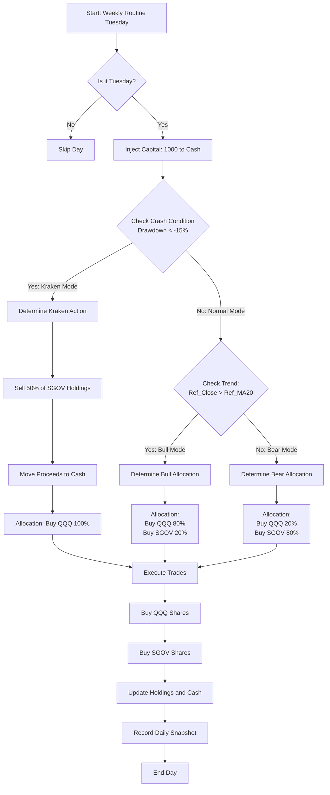

# 策略核心逻辑 (Trading Strategy Logic)

本文档描述了 `ws-test.py` 回测脚本中执行的量化交易策略。该策略旨在通过动态资产配置（QQQ vs SGOV）在捕捉美股趋势的同时控制下行风险。

## 1. 核心参数 (Configuration)

*   **交易频率**: 每周一次 (周二执行)
*   **定投金额**: 每周 $1,000 (注入本金)
*   **标的资产**:
    *   **进攻资产 (Risk)**: `QQQ` (纳斯达克100 ETF)
    *   **防守资产 (Safe)**: `SGOV` (超短债 ETF / 现金等价物)
*   **技术指标**:
    *   **均线**: 20日简单移动平均线 (MA20)
    *   **依据**: **昨日收盘价** (Ref_Close) vs **昨日均线** (Ref_MA20) —— *避免未来函数*
    *   **滑点**: 0.05% (模拟交易成本)

## 2. 决策模式 (Decision Modes)

策略根据市场状态分为三种模式，优先级从高到低：

### 🔥 模式 A: 史诗级抄底 (The Kraken / Crash Mode)
*   **触发条件**: 
    1.  QQQ 动态回撤 (Drawdown) 超过 **-15%** (相对于历史最高点)。
    2.  账户中仍持有 SGOV。
*   **执行动作**:
    *   **卖出防守仓位**: 卖出当前持有 SGOV 的 **50%**。
    *   **All-in 进攻**: 将每周定投的 $1,000 + 卖出 SGOV 获得的现金，**100% 买入 QQQ**。
*   **逻辑**: 在市场恐慌暴跌时，释放储备弹药，收集廉价筹码。

### 🐂 模式 B: 牛市进攻 (Bull Mode)
*   **触发条件**: QQQ 昨日收盘价 **>** 昨日 MA20 均线。
*   **执行动作**:
    *   **80%** 资金买入 **QQQ**。
    *   **20%** 资金买入 **SGOV**。
*   **逻辑**: 趋势向上时放大风险敞口，同时保留少量现金流。

### 🐻 模式 C: 熊市防御 (Bear Mode)
*   **触发条件**: QQQ 昨日收盘价 **<=** 昨日 MA20 均线。
*   **执行动作**:
    *   **20%** 资金买入 **QQQ** (保持最低限度的在场感)。
    *   **80%** 资金买入 **SGOV** (囤积现金)。
*   **逻辑**: 趋势转弱时，大幅减少风险投入，转而囤积“子弹”，等待下一次机会（抄底或趋势反转）。

---

## 3. 流程图 (Mermaid Flowchart)

